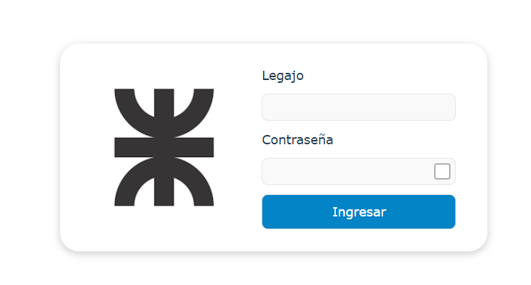

# Sysacad

Sysacad. Gestion de alumnos de la Universidad Tecnologica Nacional de Rosario

## Descripción 📋

Por ahora es un rediseño de la pagina original que se bastante antigua. (Adjunto link pagina original: <a>https://www.alumnos.frro.utn.edu.ar/loginAlumno.asp?refrescar<a/>)

<!-- ## Insignias

Insignias que muestran metadatos como el estado de la compilación, la cobertura de las pruebas, el estado de las dependencias, etc. -->

## Visuales 🚀




### Instalación 🔧

Una guía paso a paso sobre cómo configurar el entorno de desarrollo e instalar todas las dependencias.

```bash
# git clone URL_DEL_REPOSITORIO
```

```bash
# cd ./sysacad-login/
```

```bash
# npm install
```

```bash
# npm run dev
```

### PARTICIPAR DEL CODIGO

Crear una rama con un nombre explicativo de los cambios hechos y generar un PR.